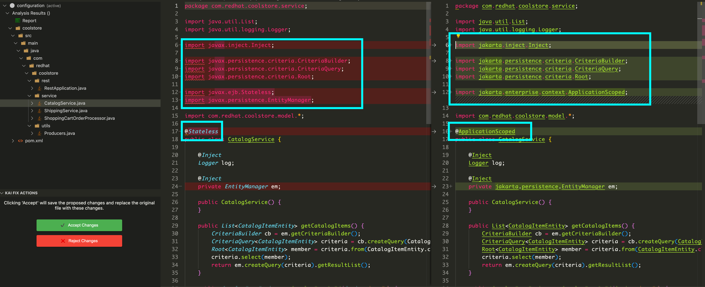
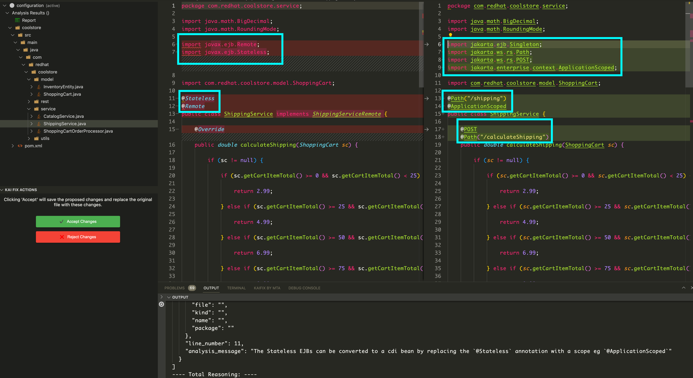
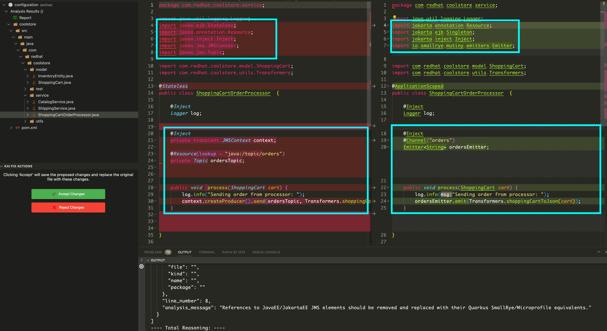

# Kai Demo

Konveyor AI (kai) is Konveyor's approach to easing modernization of application source code to a new target by leveraging LLMs with guidance from static code analysis augmented with data in Konveyor that helps to learn how an Organization solved a similar problem in the past (Source: https://github.com/konveyor-ecosystem/kai/blob/main/README.md)

In this demo, we will showcase the capabilities of Konveyor AI (Kai) in facilitating the modernization of application source code to a new target. We will illustrate how Kai can handle various levels of migration complexity, ranging from simple import swaps to more involved changes such as modifying scope from CDI bean requirements. Additionally, we will look into migration scenarios that involves EJB Remote and Message Driven Bean(MBD) changes

We will focus on migrating a partially migrated [JavaEE Coolstore application](https://github.com/konveyor-ecosystem/coolstore.git) to Quarkus, a task that involves not only technical translation but also considerations for deployment in OpenShift.

## Pre-req

- Podman
- VSCode
- Git
- OpenShift cluster
- GenAI credentials
- mvn
- Quarkus 3.10
- Java 17

## Step 1: Setup

In this step, we will configure the Kai IDE plugin within VSCode to showcase the capabilities of Kai. For this demo, we will be using the model `meta-llama/llama-3-70b-instruct` within the Kai configuration. This setup ensures that the demo runs seamlessly within the VSCode environment, highlighting the efficiency and power of Kai for code migration in the context of our specific scenario.

### Setup Kai VSCode IDE plugin

- Follow along the steps listed in [here](https://github.com/konveyor-ecosystem/kai/tree/main/ide) to intergrate Kai IDE plugin with VSCode.

- Before starting the Kai server, Select model `meta-llama/llama-3-70b-instruct` by adding this to `kai/config.toml` file

```yaml
provider = "IBMOpenSource"
args = { model_id = "meta-llama/llama-3-70b-instruct", max_new_tokens = 2048 }
```

If you are interested in using `gpt-3.5-turbo` refer to the section below,

#### Running Kai with GPT-3.5

- Export your OpenAI api key `export OPENAI_API_KEY="<your-openai-api-key>"`

- Before starting the Kai server, Select model `gpt-3.5-turbo` by adding this to `kai/config.toml` file

```yaml
provider = "OpenAI"
args = { model_id = "gpt-3.5-turbo" }
```

- Run the server using `make run-server`

#### Run Kai with demo mode

If you don't have access to

## Step 2: Demo

In this demo, we will explore Kai's capabilities through practical examples within the Coolstore application.

### 2.1 Clone the coolstore app

Let's clone the Coolstore application, which we will be used demo the migration process to Quarkus.

1. To clone the Coolstore demo from its repository -

   ```bash
   git clone https://github.com/konveyor-ecosystem/coolstore.git
   ```

2. Next, switch to the branch of the Coolstore app that's been partially migrated -

   ```bash
   git checkout partial-migration
   ```

### 2.2 Run Analysis

We will analyze the Coolstore application using the following migration targets to identify potential areas for improvement:

- containterization
- jakarta-ee
- jakarta-ee8+
- jakarata-ee9+
- quarkus

1. Open VSCode and load coolstore project if it is not already loaded.
2. Follow steps from 1 through 4 from https://github.com/konveyor-ecosystem/kai/tree/main/ide#usage-summary
3. Once the analysis is complete you will see incidents listed on the following files

- `src/main/java/com/redhat/coolstore/model/ShoppingCart.java`
- `src/main/java/com/redhat/coolstore/model/InventoryEntity.java`
- `src/main/java/com/redhat/coolstore/service/CatalogService.java`
- `src/main/java/com/redhat/coolstore/service/ShippingService.java`
- `src/main/java/com/redhat/coolstore/service/ShoppingCartOrderProcessor.java`

The incidents in the above files will provide insights into potential issues or areas that require attention during the migration process.

#### 2.2.1 Change import namespaces

- Right-click on the file `src/main/java/com/redhat/coolstore/model/ShoppingCart.java`.
- Select Kai Fix-All.
- Accept the proposed changes.
- Repeat the same process for the file - `src/main/java/com/redhat/coolstore/model/InventoryEntity.java`.


Th above steps show how Kai simplifies the translation of import namespaces, ensuring seamless automated migration of javax libraries to jakarta persistence libraries.

#### 2.2.2 Modify Scope from CDI bean requirements

In this step, we will use Kai to modify the scope in `CatalogService.java` to adhere to Quarkus CDI bean requirements. Kai will handle this automatically, ensuring seamless migration.

- Right-click on the file `src/main/java/com/redhat/coolstore/service/CatalogService.java`.
- Select Kai Fix-All.
- Accept the proposed changes.



#### 2.2.3 EJB Remote and Message Driven Bean(MDB) changes

We will address EJB Remote and MDB functionalities in `ShippingService.java` and `ShoppingCartOrderProcessor.java` respectively. Kai will guide us through replacing EJBs with REST functionality and updating related imports and annotations.

##### EJB Remote

- Right-click on the file `src/main/java/com/redhat/coolstore/service/ShippingService.java`.
- Select `Kai Fix-All`.
- Accept the proposed changes.

After applying the changes, you may notice unwanted imports such as `import jakarta.ejb.Singleton;`. Remove this import and save the file.



Due to the absence of support for Remote EJBs in Quarkus, you will notice that these functionalities are removed and replaced with REST functionality.

##### Message Driven Bean(MDB)

- Right-click on the file `src/main/java/com/redhat/coolstore/service/ShoppingCartOrderProcessor.java`.

- Select `Kai Fix-All` and accept the changes.

- You will notice unwanted imports like `import jakarta.ejb.Singleton;`. Remove this import from the file and save it.

- Check for any missing imports. If you find `import jakarta.enterprise.context.ApplicationScoped;` missing, add it to the file.



- Note the changes made to `ordersEmitter` channel:

  ```java
  @Inject
  @Channel("orders")
  Emitter<String> ordersEmitter;
  ```

  Although this change is valid, it's important to note that the LLM is unaware of the number of consumers for `orders` channel. It assumed that there is a single consumer for `orders`, but, this app has multiple consumers of `orders`. Assuming there's only a single consumer can lead to `io.smallrye.reactive.messaging.providers.wiring.TooManyDownstreamCandidatesException`. To avoid this, add the `@Broadcast` annotation:

  ```java
  import io.smallrye.reactive.messaging.annotations.Broadcast;

  @Inject
  @Channel("orders")
  @Broadcast
  Emitter<String> ordersEmitter;
  ```

- Since the LLM doesn't have access to the project's `pom.xml` file, it lacks information about available dependencies. Update the import statements to the following:

  ```java
  import org.eclipse.microprofile.reactive.messaging.Channel;
  import org.eclipse.microprofile.reactive.messaging.Emitter;
  ```


### 2.3 Deploy app to OpenShift

Now, its time to deploy the coolstore quarkus app on OpenShift cluster.

- Make sure you can access the cluster from your terminal
- Navigate to the coolstore project folder
- Deploy a postgres container

```bash
oc new-app -e POSTGRESQL_USER=quarkus \
            -e POSTGRESQL_PASSWORD=quarkus \
            -e POSTGRESQL_DATABASE=coolstore \
            openshift/postgresql:latest \
            --name=coolstore-database
```

- Once the postgres container is deployed, deploy the coolstore app using the following command

```mvn
mvn clean compile package -Dquarkus.kubernetes.deploy=true
```

- Once deployed, access the website via `http://coolstore-<namespace>.apps.ai.migration.redhat.com`


### Conclusion

In this demo, we showcased the capability of Kai in facilitating various types of code migrations within the Coolstore application. By leveraging Kai's capabilities, organizations can expedite the modernization process. If you are intereted to learn more about our ongoing efforts and future plans, please reach out to us in the [slack channel](https://kubernetes.slack.com/archives/CR85S82A2)
